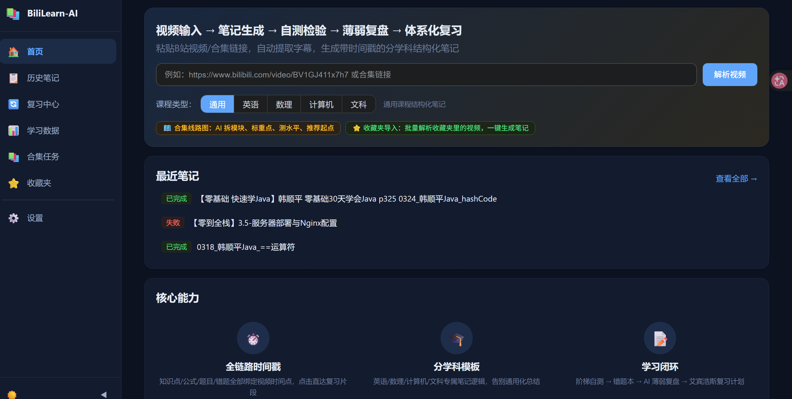
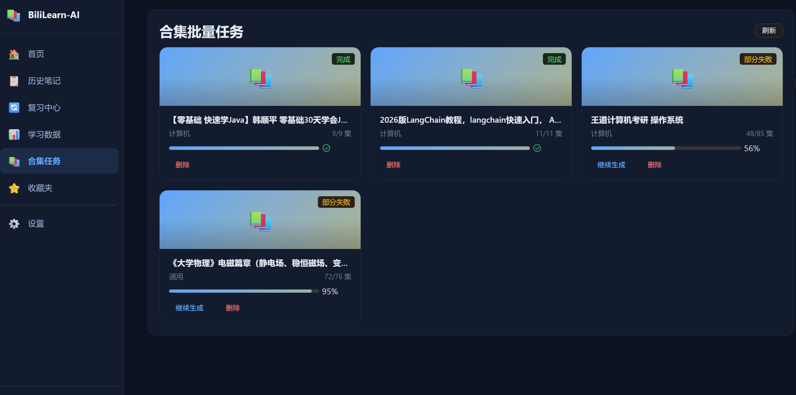
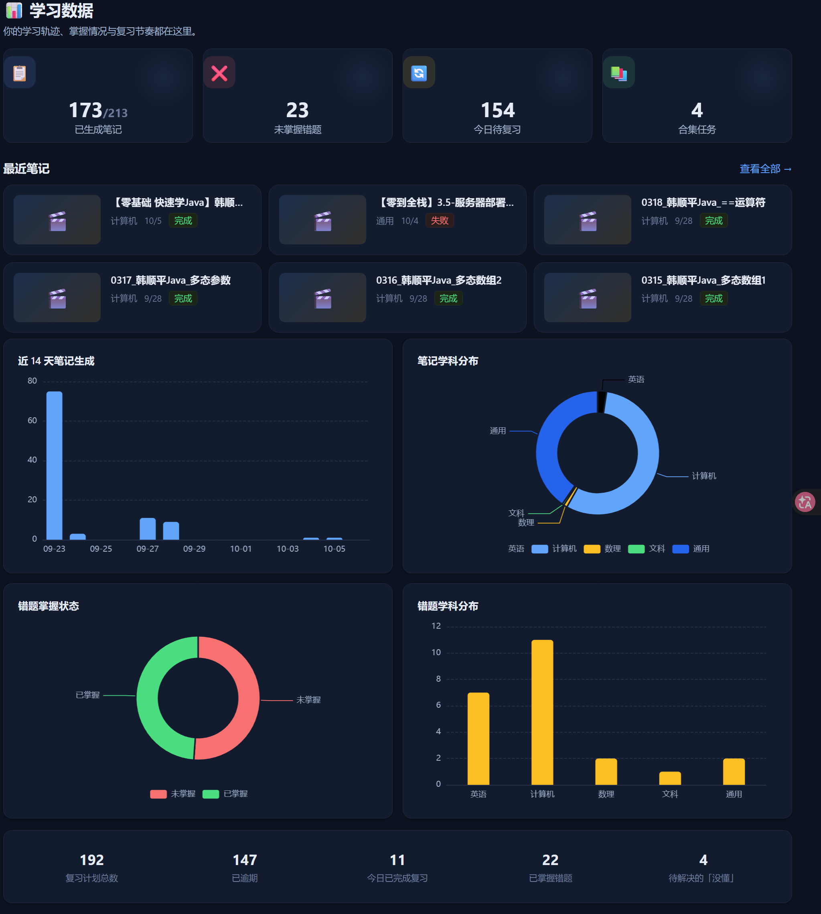
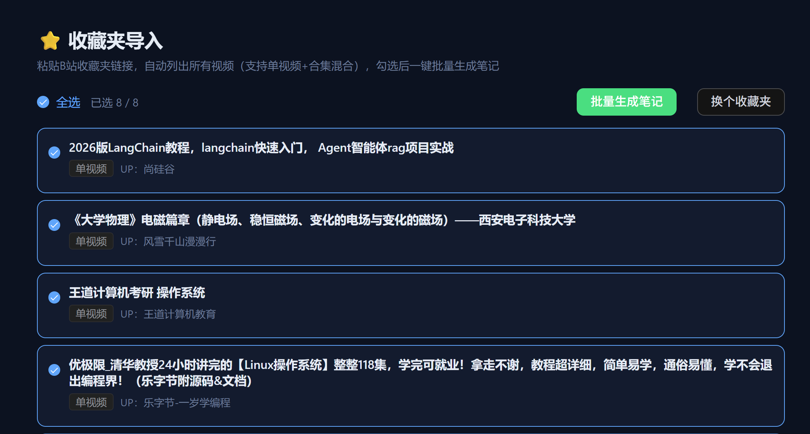
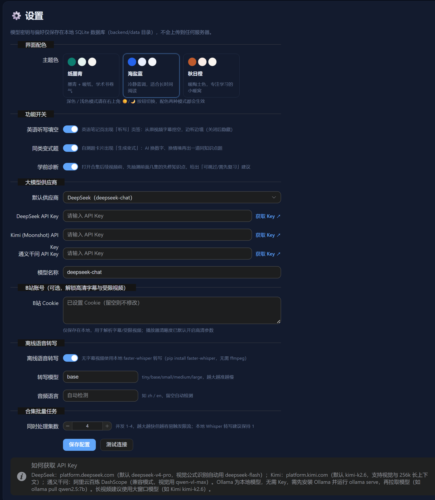
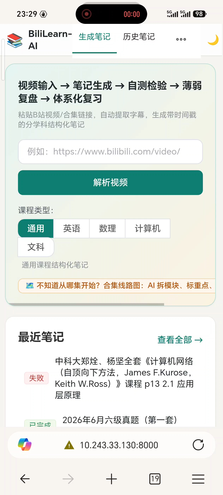

# BiliLearn-AI

把 B 站学习视频转成结构化笔记、自测题和可打印复习资料的本地工具。

输入单个视频或合集链接，程序自动提取字幕、调用大模型生成笔记，知识点全部绑定视频时间戳，点击即可跳转到对应片段。同时提供 Chromium 浏览器扩展，可在 B 站页面内以侧边栏直接生成和浏览笔记。

所有数据保存在本地 SQLite，API Key 不上传。

---

## 界面预览

| 主界面 | 合集管理 |
| :---: | :---: |
|  |  |

| 学习数据 | 收藏夹导入 |
| :---: | :---: |
|  |  |

| 设置 | 手机访问 |
| :---: | :---: |
|  |  |

---

## 功能

**笔记生成**
- 按「定义 → 推导 → 例题 → 结论」组织，而非字幕原文堆砌
- 内置数理、计算机、英语、文科、通用五套学科模板
- 知识点绑定 `HH:MM:SS` 时间戳，点击跳转视频片段
- LaTeX 公式渲染、Mermaid 思维导图
- 无官方字幕时可用 faster-whisper 本地离线转写

**合集处理**
- 解析合集后列出全部分集，可指定起止集数范围
- 后台并发生成，默认 4 路（可在 1–6 之间调整），进度实时可见
- 连续网络失败会自动暂停；恢复网络后可从断点继续，已完成的集数不重复生成
- 单集失败可单独重试
- 合集线路图：按知识模块分组，标注重难点，给出建议学习起点

**复习与自测**
- 合集复习资料：将多集笔记按知识逻辑（而非视频顺序）蒸馏重排，导出可打印 PDF / Word，含目录页码、学习目标、易混辨析、章节测试、答案、术语索引和速记卡
- 自测题支持单选、判断、填空、计算、简答，可手动生成、生成变式题
- 基于笔记上下文的 AI 答疑，支持多轮对话
- 错题自动归集
- 笔记可标记「未学 / 学习中 / 已学完」，合集显示整体进度

**其他**
- 知识点关联图谱（ECharts 力导向图，点击节点跳转笔记）
- 按标题和摘要搜索笔记
- 单篇笔记导出 Markdown / PDF / Word，英语内容可导出 Anki 卡片
- 扩展内一键截取视频画面，自动命名下载并记录所属视频与时间点

---

## 快速开始

### 环境要求

- Python 3.10+
- Node.js 18+（仅在前端未预构建时需要，便携版已内置构建产物）

> 安装 Python 时勾选「Add Python to PATH」。安装完成后在终端执行 `python --version` 和 `node --version`，能显示版本号即可。

### 方式一：便携版（Windows，推荐）

从 [Release 页面](https://github.com/yxyusage/BiliLearn-AI/releases/latest) 下载 `BiliLearn-AI-v1.7.0-portable.zip`，解压后双击根目录的 `BiliLearn-AI-Launcher.exe`，点击「启动服务」。

启动器会自动完成虚拟环境创建、依赖安装（使用国内镜像）和前端检查，首次运行需几分钟，之后启动只需数秒。完成后浏览器自动打开。

启动器还支持：API Key / 模型 / 端口配置、实时日志、数据目录打开、版本检查，以及关闭窗口后最小化到系统托盘。

### 方式二：命令行脚本

适合 macOS / Linux，或不想用图形启动器的用户。

下载源码（`Code → Download ZIP`，或 `git clone`）后，在项目根目录执行：

```bash
# Windows
start.bat

# macOS / Linux
chmod +x start.sh
./start.sh
```

脚本会自动创建虚拟环境、安装依赖、构建前端并启动服务，成功后访问 http://localhost:8000。

> 若通过 `Download ZIP` 获取源码后又想使用图形界面，可单独下载 `BiliLearn-AI-Launcher.exe` 并放到项目根目录（与 `backend/`、`frontend/` 同级），否则启动器找不到后端文件。

### 配置 API Key

1. 打开页面，点击右上角「设置」
2. 选择模型供应商，填入 API Key
3. 点击「测试连接」确认可用后保存

API Key 仅保存在本地数据库中。

### 生成第一篇笔记

1. 首页粘贴 B 站视频链接，点击「解析」
2. 点击「生成笔记」，等待完成（时长取决于视频长度）
3. 生成后自动进入笔记详情页

---

## 浏览器扩展

扩展可在 B 站页面内以侧边栏完成笔记生成与浏览，无需切换标签页。


> 完整录屏：[docs/images/sidepanel.mp4](docs/images/sidepanel.mp4)

1. 打开 Chrome 或 Edge，地址栏输入 `chrome://extensions/`（Edge 为 `edge://extensions/`）
2. 目前edge浏览器上的插件还有些bug，推进使用Chrome
3. 打开右上角「开发者模式」
4. 点击「加载已解压的扩展程序」，选择项目下的 `extension/` 目录

使用前确保后端服务已启动。侧边栏包含笔记、答疑、题目、合集和截图五个面板。

> Edge 用户需在扩展详情页的「站点访问权限」中，开启对 `https://*.bilibili.com/*` 和 `http://127.0.0.1:8000/*` 的访问权限。扩展与 Web 端共用同一份本地数据库。

---

## 手机访问

电脑启动服务后，手机与电脑连接同一 WiFi（或电脑热点），浏览器访问 `http://电脑IP:8000`。

Windows 下在终端执行 `ipconfig`，找到对应网卡的 IPv4 地址；若无法连接，检查电脑防火墙是否放行 8000 端口。

---

## 工作原理

### 整体架构

```
┌─────────────────────────────────────────────────────┐
│  Web 前端 (Vue 3 + Element Plus + Vite + Pinia)       │
│  播放器联动 · 笔记渲染 · 自测交互 · 复习与图谱         │
└──────────────────────┬──────────────────────────────┘
                       │ HTTP / REST API
┌──────────────────────▼──────────────────────────────┐
│  后端 (FastAPI)                                       │
│                                                       │
│   视频解析        笔记生成         自测 / 复习 / 导出    │
│  (bilibili)     (note_gen)       (quiz/review/export) │
│   yt-dlp         map-reduce                           │
│       └───────────────┬───────────────────────────┘   │
│                       ▼                                │
│              LLM 统一封装层                             │
│              DeepSeek / Kimi / Qwen / Ollama           │
│                       │                                │
│                       ▼                                │
│              SQLite（笔记 / 字幕 / 错题 / 配置）         │
└───────────────────────────────────────────────────────┘
                       ▲
                       │ 消息通信
┌──────────────────────┴──────────────────────────────┐
│  浏览器扩展 (Chromium MV3)                            │
│  content script · background · side panel            │
│  获取视频信息 · 控制播放器 · 侧边栏浏览               │
└──────────────────────────────────────────────────────┘
```

### 笔记生成流程

```
视频 / 合集链接
      │
      ▼
yt-dlp 解析视频信息并提取字幕
      │
      ├─ 优先使用 B 站官方 CC 字幕
      └─ 无字幕时可选 faster-whisper 离线转写
      ▼
字幕按 6000 字符切分（map 阶段）
      ▼
每块独立调用大模型生成小节笔记（套用学科模板）
      ▼
全局汇总（reduce 阶段）：合并重复知识点、生成章节结构与思维导图
      ▼
写入 SQLite，由前端 / 扩展展示
```

字幕分块采用 map-reduce：完整字幕按 6000 字符切成多块，每块独立生成小节笔记，全部完成后再调用一次大模型做全局汇总。这样可以在模型上下文窗口有限的情况下处理长视频，分块大小可在 `backend/app/config.py` 的 `subtitle_chunk_chars` 调整。

---

## 目录结构

```
BiliLearn-AI/
├── backend/
│   ├── app/
│   │   ├── main.py              # FastAPI 入口
│   │   ├── config.py            # 配置（分块大小、转写开关等）
│   │   ├── database.py          # SQLite 连接与迁移
│   │   ├── models.py            # 数据模型
│   │   ├── routers/             # API 路由
│   │   │   ├── notes.py         # 笔记 CRUD 与生成
│   │   │   ├── collections.py   # 合集批量任务
│   │   │   ├── roadmap.py       # 合集线路图
│   │   │   ├── favorites.py     # 收藏夹导入
│   │   │   ├── review_material.py
│   │   │   ├── quiz.py
│   │   │   ├── export.py
│   │   │   └── config.py        # 网页设置
│   │   └── services/
│   │       ├── bilibili.py      # 视频解析与字幕提取
│   │       ├── note_generator.py
│   │       ├── review_material.py
│   │       ├── quiz_generator.py
│   │       ├── prompts.py       # 学科 Prompt 模板
│   │       └── llm/             # 大模型封装（factory / openai_compat / ollama）
│   ├── data/                    # 运行时数据（不入库）
│   └── requirements.txt
├── frontend/
│   └── src/
│       ├── views/
│       ├── components/
│       └── utils/theme.js       # 配色主题
├── extension/                   # Chromium 扩展
│   ├── manifest.json
│   ├── background.js
│   ├── content/
│   ├── sidepanel/
│   └── icons/
├── launcher/                    # 图形启动器（main.py + 打包脚本）
├── start.bat / start.sh         # 一键启动脚本
└── README.md
```

---

## 模型支持

| 供应商 | Key 申请 | 默认模型 | 说明 |
| --- | --- | --- | --- |
| DeepSeek | platform.deepseek.com | deepseek-chat | 综合成本低，推荐 |
| Kimi | platform.moonshot.cn | kimi-k2.6 | 上下文窗口大，适合长视频 |
| 通义千问 | 阿里云百炼 | qwen-plus | 支持视觉模型 |
| Ollama | 本地运行，无需 Key | qwen2.5:7b | 完全离线 |

接口地址与模型名均可在设置中覆盖，因此也兼容任何 OpenAI 协议格式的第三方中转服务。

---

## 常见问题

**浏览器没有自动打开？**
手动访问 http://localhost:8000。

**提示「未检测到官方字幕」？**
该视频没有 CC 字幕。可在设置中开启离线语音转写（faster-whisper），支持中英文。

**长视频笔记不完整？**
可调小 `backend/app/config.py` 中的 `subtitle_chunk_chars`，或换用更大上下文窗口的模型。

**端口 8000 被占用？**
关闭占用该端口的旧实例，或在启动器设置中改用其他端口。

**扩展提示「无法获取视频信息」？**
刷新 B 站页面、等待完全加载后再打开扩展；Edge 用户检查站点访问权限是否已开启。

**数据保存在哪里？**
`backend/data/bililearn.db`，每份笔记另存一份 Markdown 到 `backend/data/notes/`。

---

## 合规声明

本项目仅供个人学习研究使用，不缓存、不传播完整视频，仅处理字幕文本与生成的笔记内容。请尊重 UP 主与平台版权，勿用于商业用途。

## License

MIT
