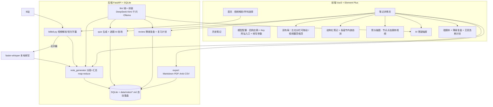
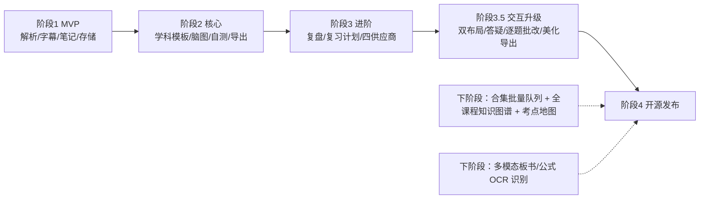
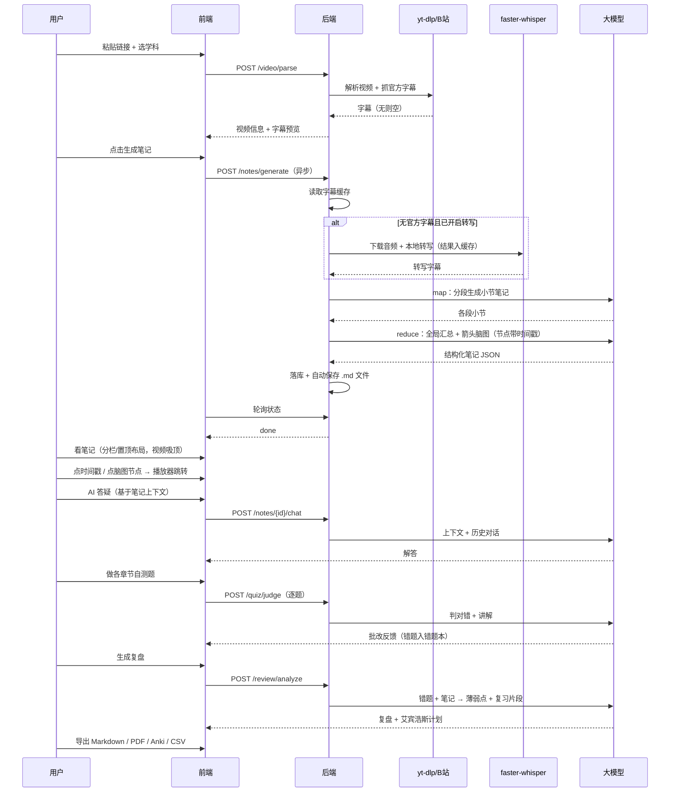

# BiliLearn-AI 架构与规划

## 1. 总体项目规划图

## 2. 阶段路线图

## 3. 核心运行流程图（视频 → 学习闭环）

## 4. 进一步优化方向

### 已交付（v1.1）
- ✅ 合集批量异步队列（后台逐集生成、进度实时展示、已完成集复用缓存）
- ✅ 全课程知识图谱（箭头 graph TD、节点 p页码_HHMMSS 点击跨集跳转）+ 考点地图（必考/掌握/了解分级）
- ✅ 多模态公式/板书识别（PyAV 关键帧提取无需 ffmpeg + qwen-vl-plus/kimi-vision 转 LaTeX）
- ✅ 深浅主题一键切换、AI 答疑图示化回答、逐题 AI 批改、分栏独立滚动、分隔条拖动、代理不可用自动直连
- ✅ GitHub Actions CI、CHANGELOG、Docker 健康检查

### 功能层
| 优先级 | 优化项 | 说明 |
| --- | --- | --- |
| 中 | 播放进度联动 | 监听播放器播放进度，自动高亮正在讲解的知识点（postMessage + 时间区间匹配） |
| 中 | 笔记 LaTeX 实时渲染 | 前端引入 KaTeX，把 $...$ 与 $$...$$ 渲染为公式（数理专项体验关键） |
| 中 | 代码高亮 | cs 专项代码块前端语法高亮 + 一键复制 |
| 中 | 双语对照 | 英语专项提供「原文 + 逐句翻译」并行对照视图 |
| 低 | 任务管理面板 | 失败重试、任务队列可视化、API 成本统计 |
| 低 | 字幕后处理 | 转写字幕时间戳纠偏、重复句合并、VAD 静音过滤加速转写 |
| 低 | 合集精简模式 | 仅生成总框架 + 重点章节，降低大批量成本 |

### 工程层
| 优化项 | 说明 |
| --- | --- |
| 前端体积优化 | mermaid 等大依赖按需加载 / manualChunks 拆分（当前单 chunk 1MB+） |
| GPU 转写支持 | whisper device 配置化（当前固定 CPU，兼容性优先） |
| 移动端适配 | 分栏布局在窄屏自动降级为视频置顶模式 |
| CI + 打包 | GitHub Actions：单元测试 + 构建镜像；Release 发布 |
| 鉴权（可选） | 本地单用户定位下暂不需要，如需公网部署可加简单访问口令 |

## 5. 数据与合规边界

- 所有数据仅存本地：SQLite（backend/data/bililearn.db）+ Markdown（backend/data/notes/）
- 模型密钥仅存本地数据库，API 调用只发送字幕文本与笔记内容
- 不缓存、不传播视频本体，仅处理字幕与学习产物，仅限个人学习使用
