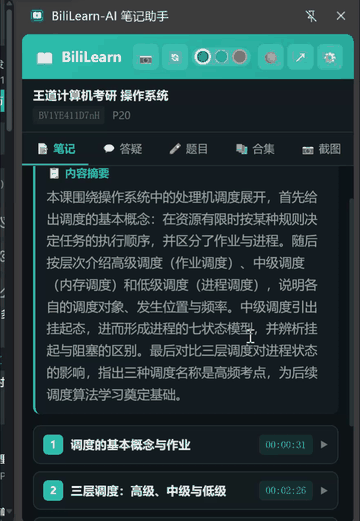

# BiliLearn-AI 浏览器插件

在 B 站看视频时，通过右侧侧边栏一键生成并浏览 AI 结构化笔记，支持时间戳跳转、完整知识点浏览、字体/主题自定义。

## 演示



> 完整录屏：[../docs/images/sidepanel.mp4](../docs/images/sidepanel.mp4)

## 功能

- 🎬 自动识别当前 B 站视频（BV号、分P、标题）
- ⚡ 一键生成 AI 结构化笔记，侧边栏内实时显示生成进度
- 📑 完整笔记浏览：摘要、章节目录、知识点详情（定义/公式/代码/表格/步骤）
- ⏱️ 点击时间戳直接跳转视频对应位置
- 📚 合集任务列表查看
- ⚙️ 设置页：字体大小调节（12-20px）、浅色/深色主题、章节默认展开、后端地址配置
- 🔗 一键打开完整笔记页面（AI对话、自测题、导出等高级功能）
- 🟢 后端连接状态实时显示

## 安装方法（开发者模式）

### Chrome（推荐）
1. 打开 Chrome，地址栏输入 `chrome://extensions/`
2. 开启右上角「开发者模式」
3. 点击「加载已解压的扩展程序」
4. 选择本项目的 `extension` 文件夹
5. 插件安装完成，工具栏会出现 BiliLearn-AI 图标

### Edge
1. 打开 Edge，地址栏输入 `edge://extensions/`
2. 开启左下角「开发人员模式」
3. 点击「加载解压缩的扩展」
4. 选择本项目的 `extension` 文件夹
5. **重要**：在插件详情页的「站点访问权限」中，打开 `https://*.bilibili.com/*` 和 `http://127.0.0.1:8000/*` 的子开关

## 使用方法

1. 先启动 BiliLearn-AI 后端（运行项目根目录的 `start.bat`）
2. 打开任意 B 站视频页面
3. 点击工具栏的 BiliLearn-AI 插件图标 → 右侧自动打开侧边栏
4. 点击「生成笔记」，等待 AI 生成（侧边栏内显示进度条）
5. 生成完成后，展开章节查看知识点，点击时间戳跳转视频
6. 侧边栏底部「设置」可调节字体大小、切换主题

## 侧边栏标签页

- **笔记**：当前视频的笔记内容（生成/浏览/跳转）
- **合集**：合集批量任务列表和进度
- **设置**：字体大小、主题、后端地址、章节默认展开

## 注意事项

- 插件依赖本地后端服务，后端未启动时无法生成笔记
- 仅在 B 站视频页面（`bilibili.com/video/`）生效
- 笔记数据存储在本地数据库，不会上传到任何服务器
- 生成笔记需要配置好 AI API Key（在后端设置页面配置）
- 侧边栏需要 Chrome/Edge 114+ 版本（支持 Side Panel API）
- Edge 用户如遇 content script 注入失败，请检查站点访问权限的子开关是否打开
- **升级插件后必须回到 `edge://extensions/` / `chrome://extensions/` 点一次「🔄 重新加载」**，否则浏览器仍在跑旧代码

## 更新日志（插件）

### 2.2.0
- 修复 Edge 侧边栏下"识别不到当前视频"的问题：原来只查"当前窗口的活动标签页"，Edge 拿不到时会直接报"当前视频暂无笔记"（生成笔记、截图、答疑全部失效）。现在按「活动标签页 → 最近聚焦窗口的活动标签页 → 按 URL 查找所有 B 站视频页 → 上次记住的标签页」逐级兜底
- 内容脚本没注入时（Edge 站点权限、扩展刚更新、B 站站内 SPA 跳转）自动补注入一次再重试，不再直接报"无法获取视频信息"
- 错误提示改为说真话：区分"未检测到 B 站视频标签页"、"当前标签页不是视频页（会显示实际地址）"、"已找到视频页但读不到视频信息"
- 「生成笔记」在没有识别到视频时不再静默无反应，会提示先切到视频页
- 截图功能在标签页未识别时会再兜底查找一次

## 文件结构

```
extension/
├── manifest.json          # 插件配置（MV3，Side Panel）
├── background.js          # 后台 Service Worker，API 转发+侧边栏行为
├── content/
│   ├── content.js         # 注入 B 站页面，获取视频信息+控制播放器
│   └── content.css        # 注入页面样式
├── sidepanel/
│   ├── sidepanel.html     # 侧边栏主页面
│   ├── sidepanel.css      # 侧边栏样式（浅色/深色主题）
│   └── sidepanel.js       # 侧边栏逻辑（笔记渲染/设置/合集）
├── popup/                 # 旧版弹窗（已被侧边栏替代，保留备用）
├── icons/                 # 插件图标
└── README.md              # 本文件
```
